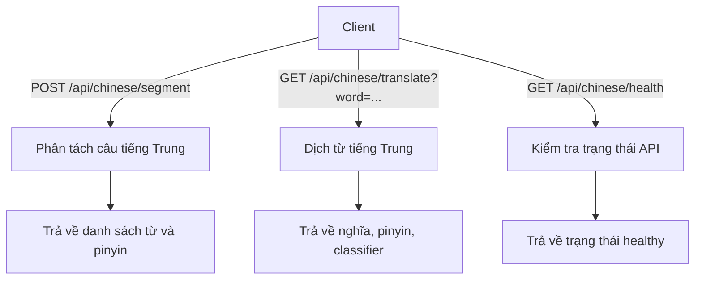

# API_Split_chinese

## Giới thiệu
Dịch vụ API phân tách câu tiếng Trung, chuyển pinyin và tra cứu nghĩa từ điển, tối ưu cho máy cấu hình yếu. Xây dựng bằng FastAPI, sử dụng từ điển CC-CEDICT, hỗ trợ Docker.

## Yêu cầu
- Python 3.10+
- Docker & docker-compose (khuyên dùng)
- Hệ điều hành Linux khuyến nghị

## Cài đặt & Chạy

### 1. Chạy bằng Docker (Khuyên dùng)
```bash
cd API_Split_chinese
docker-compose up -d --build
```
- API sẽ chạy tại: http://localhost:8058/api/chinese

### 2. Chạy thủ công (không Docker)
```bash
cd API_Split_chinese
python3 -m venv venv && source venv/bin/activate
pip install -r requirements.txt
uvicorn main:app --host 0.0.0.0 --port 8058
```

## Các endpoint API



### 1. Phân tách câu & chuyển pinyin
- **POST** `/api/chinese/segment`
- **Body:** JSON array các câu tiếng Trung
```json
[
  "我喜欢学习中文。",
  "今天天气很好。"
]
```
- **Response:**
```json
[
  [
    {"word": "我", "pinyin": "wǒ"},
    {"word": "喜欢", "pinyin": "xǐhuān"},
    {"word": "学习", "pinyin": "xuéxí"},
    {"word": "中文", "pinyin": "zhōngwén"},
    {"word": "。", "pinyin": ""}
  ],
  ...
]
```

### 2. Tra cứu nghĩa từ
- **GET** `/api/chinese/translate?word=中文`
- **Response:**
```json
[
  {
    "traditional": "中文",
    "simplified": "中文",
    "pinyin_numbered": "zhong1 wen2",
    "pinyin": "zhōng wén",
    "meanings": ["Chinese language"],
    "classifiers": []
  }
]
```

### 3. Health check
- **GET** `/api/chinese/health`
- **Response:**
```json
{"status": "healthy", "timestamp": 1710000000.0}
```

## Monitoring & Tối ưu hóa
- Có thể chạy script giám sát tài nguyên:
```bash
./monitor.sh
```
- Xem log: `docker-compose logs -f fastapi-app`
- Kiểm tra tài nguyên: `docker stats fastapi-segment`

## Troubleshooting
- Nếu CPU/memory cao: giảm concurrency, tăng RAM, giảm cache.
- Nếu API chậm: kiểm tra network, tăng worker nếu đủ CPU.
- Nếu container tự restart: kiểm tra log, tối ưu lại cấu hình.

## Ghi chú
- API tối ưu cho máy yếu, tự động cache và giải phóng bộ nhớ.
- Có thể mở rộng thêm endpoint hoặc tích hợp hệ thống khác dễ dàng. 